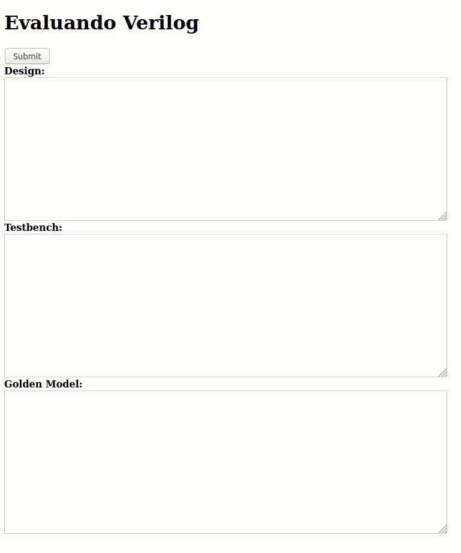

# UNCode-Digital Version 0.1
Incluye el código de las páginas creadas para la comparación y visualización de diferencias de diseños digitales escritos en Verilog y VHDL.

Funcionamiento en Verilog:

